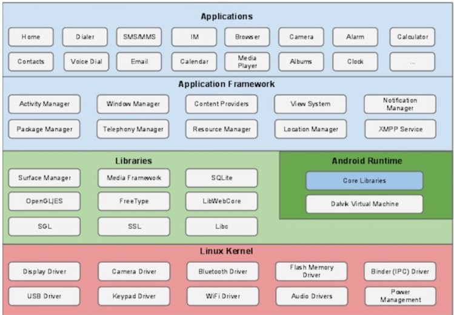

 <!-- Author : pickjly
 Email  : 2461789521@qq.com
 Date   : 2021-06-20
 Time   : 9:00
 File   : @pickjly_Android.md
 Content:
      学习安卓架构 -->

# 安卓

## 概述
        Android是一个开源的，基于Linux的移动设备操作系统，主要使用于移动设备，如智能手机和平板电脑。Android是由谷歌及其他公司带领的开放手机联盟开发的。

## 安卓架构

- linux 内核

        提供了基本的系统功能，比如进程管理，内存管理，设备管理（如摄像头，键盘，显示器）。同时，内核处理所有 Linux 所擅长的工作，如网络和大量的设备驱动，从而避免兼容大量外围硬件接口带来的不便。
- libraries
 
        包括了专门为 Android 开发的基于 Java 的程序库。这个类别程序库的示例包括应用程序框架库，如用户界面构建，图形绘制和数据库访问
    一些 Android 开发者可用的 Android 核心程序库总结如下：
    - android.app - 提供应用程序模型的访问，是所有 Android 应用程序的基石。
    - android.content - 方便应用程序之间，应用程序组件之间的内容访问，发布，消息传递。
    - android.database - 用于访问内容提供者发布的数据，包含 SQLite 数据库管理类。
    - android.opengl - OpenGL ES 3D 图片渲染 API 的 Java 接口。
    - android.os - 提供应用程序访问标注操作系统服务的能力，包括消息，系统服务和进程间通信。
    - android.text - 在设备显示上渲染和操作文本。
    - android.view - 应用程序用户界面的基础构建块。
    - android.widget - 丰富的预置用户界面组件集合，包括按钮，标签，列表，布局管理，单选按钮等。
    - android.webkit - 一系列类的集合，允许为应用程序提供内建的 Web 浏览能力。
- Android Runtime

        这个部分提供名为 Dalvik 虚拟机的关键组件，类似于 Java 虚拟机，但专门为 Android 设计和优化。
        Dalvik 虚拟机使得可以在 Java 中使用 Linux 核心功能，如内存管理和多线程。Dalvik 虚拟机使得每一个 Android 应用程序运行在自己独立的虚拟机进程。
        Android 运行时同时提供一系列核心的库来为 Android 应用程序开发者使用标准的 Java 语言来编写 Android 应用程序。
- Application Framework

        应用框架层以 Java 类的形式为应用程序提供许多高级的服务。应用程序开发者被允许在应用中使用这些服务。

    - 活动管理者 - 控制应用程序生命周期和活动栈的所有方面。
    - 内容提供者 - 允许应用程序之间发布和分享数据。
    - 资源管理器 - 提供对非代码嵌入资源的访问，如字符串，颜色设置和用户界面布局。
    - 通知管理器 - 允许应用程序显示对话框或者通知给用户。
    - 视图系统 - 一个可扩展的视图集合，用于创建应用程序用户界面。

- Application

        顶层中有所有的 Android 应用程序。你写的应用程序也将被安装在这层。这些应用程序包括通讯录，浏览器，游戏等。

## Android 应用程序组件

- Activities

    描述UI，并且处理用户与机器屏幕的交互。

        一个活动标识一个具有用户界面的单一屏幕。举个例子，一个邮件应用程序可以包含一个活动用于显示新邮件列表，另一个活动用来编写邮件，再一个活动来阅读邮件。当应用程序拥有多于一个活动，其中的一个会被标记为当应用程序启动的时候显示。
- Services
    处理与应用程序关联的后台操作。

        服务是运行在后台，执行长时间操作的组件。举个例子，服务可以是用户在使用不同的程序时在后台播放音乐，或者在活动中通过网络获取数据但不阻塞用户交互。
- Broadcast receviers
    处理Android操作系统和应用程序之间的通信。

        广播接收器简单地响应从其他应用程序或者系统发来的广播消息。举个例子，应用程序可以发起广播来让其他应用程序知道一些数据已经被下载到设备，并且可以供他们使用。因此广播接收器会拦截这些通信并采取适当的行动。
- Content Providers
        处理数据和数据库管理方面的问题。

            内容提供者组件通过请求从一个应用程序到另一个应用程序提供数据。这些请求由ContentResolver类的方法来处理。这些数据可以是存储在文件系统、数据库或者其他其他地方。