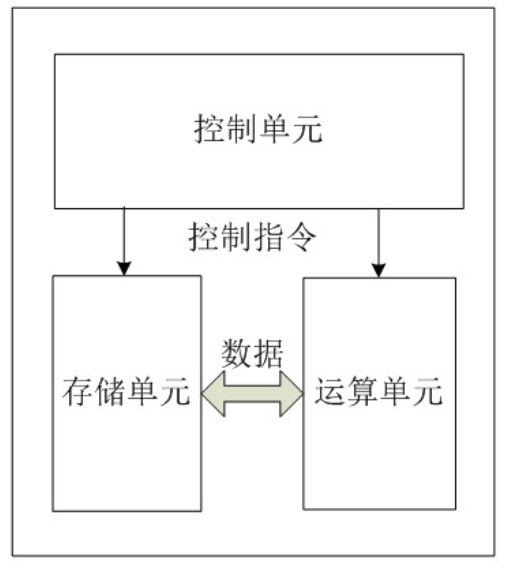
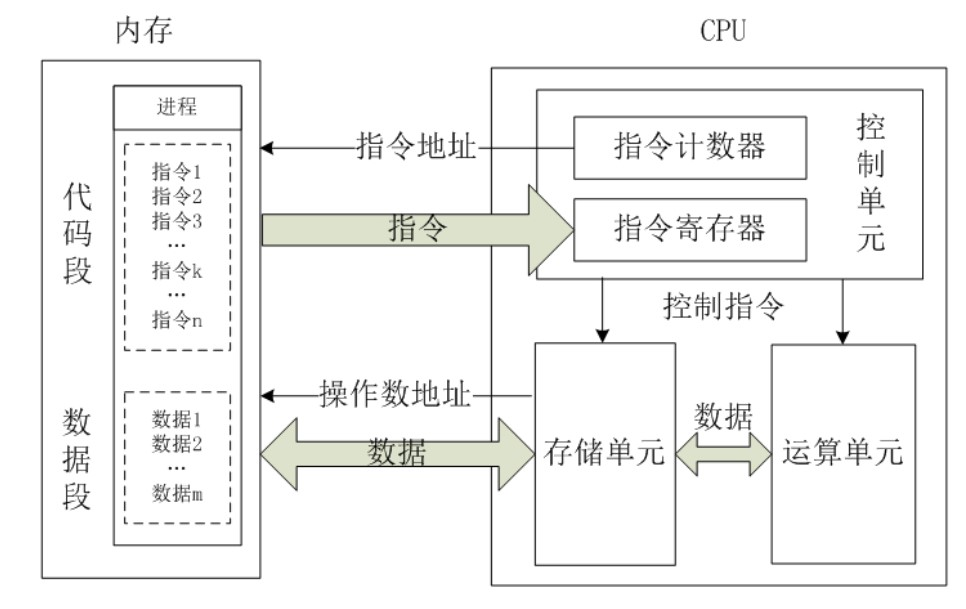

## CPU 设计理念

    所有的CPU设计，都是遵循以下三个模块去设计

- 控制单元：控制单元是整个CPU的指挥控制中心，由程序计数器PC（Program Counter）, 指令寄存器IR(Instruction Register)、指令译码器ID(Instruction Decoder)和操作控制器OC(Operation Controller)等，对协调整个电脑有序工作极为重要。它根据用户预先编好的程序，依次从存储器中取出各条指令，放在指令寄存器IR中，通过指令译码(分析)确定应该进行什么操作，然后通过操作控制器OC，按确定的时序，向相应的部件发出微操作控制信号。操作控制器OC中主要包括节拍脉冲发生器、控制矩阵、时钟脉冲发生器、复位电路和启停电路等控制逻辑。

- 运算单元：是运算器的核心。可以执行算术运算(包括加减乘数等基本运算及其附加运算)和逻辑运算(包括移位、逻辑测试或两个值比较)。相对控制单元而言，运算器接受控制单元的命令而进行动作，即运算单元所进行的全部操作都是由控制单元发出的控制信号来指挥的，所以它是执行部件。

- 存储单元：包括CPU片内缓存和寄存器组，是CPU中暂时存放数据的地方，里面保存着那些等待处理的数据，或已经处理过的数据，CPU访问寄存器所用的时间要比访问内存的时间短。采用寄存器，可以减少CPU访问内存的次数，从而提高了CPU的工作速度。但因为受到芯片面积和集成度所限，寄存器组的容量不可能很大。寄存器组可分为专用寄存器和通用寄存器。专用寄存器的作用是固定的，分别寄存相应的数据。而通用寄存器用途广泛并可由程序员规定其用途，通用寄存器的数目因微处理器而异。

## CPU 工作原理

</img>
