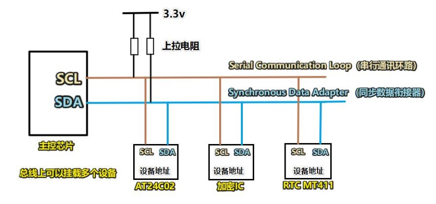
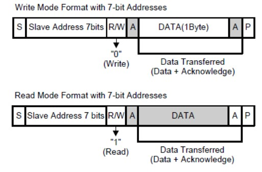
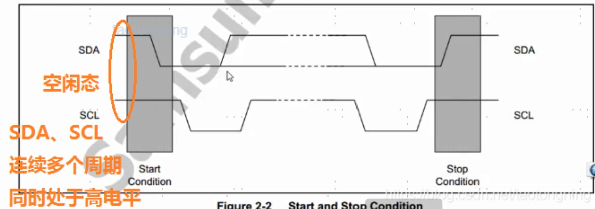

 <!-- Author : pickjly
 Email  : 2461789521@qq.com
 Date   : 2021-06-20
 Time   : 9:00
 File   : @pickjly_Linux_I2C.md
 Content:
      I2C 通信协议 -->
# I2C 总线控制系统
## I2C 简介
        I2C 总线(Inter Integrated Circuit Bus)，内部集成电路总线。由一条串行数据（SDA）线和一条串行时钟（SCL）线配对构成。时钟信号是识别数据的基准，在电路中对数据的识别要靠时钟信号来定位，这样才能准确地译码。数据信号中包含有各种需要控制的信息，它是一篥可以双方向传递的信息线。各种控制信息和受控电路中的反馈信息都在这条信息线中传递。
## I2C 详解

### 物理接口

        - SCL（serial clock）:时钟线，传输CLK信号，一般是I2C主设备向从设备提供时钟的通道。
        - SDA（serial data）：数据线，通信数据都通过SDA线传输。

### 通信特征
        - 串行： I2C属于串行通信，所有的数据以位为单位在SDA线上串行传输。
        - 同步： 同步通信就是通信双方工作在同一个时钟下
        - 非差分：因为I2C通信速率不高，而且通信双方距离很近，对干扰不敏感。
        - 低速率：本地数据传输，且传输的数据量不大。

### 主从设备

        - 设备：I2C通信的时候，通信双方地位是不对等的，而是分主设备和从设备。
        - 响应：通信由主设备发起，由主设备主导，从设备只是按照I2C协议被动的接受主设备的通信，并及时响应。
        - 工作：同一时间内，I2C的总线上只能传输一对设备的通信信息，所以同一时间只能有一个从设备和主设备通信。

### 数据传输格式

### 通信时序

        - 空闲态：如果SDA、SCL如果连续多个周期同时处于高电平，则总线一定处于空闲态。
        - 起始态：I2C处于空闲态时，SDA由高电平转低电平后，SCL由高电平转为低电平时，进入起始态，此时主设备已经准备好数据。
        - 终止态：I2C处于工作状态时，SCL先拉高，SDA随后拉高
        - 工作态：CLK上升沿锁存数据，CLK上升沿到来前SDA要提前准备好数据。

### 网站继续学习链接

        https://www.pianshen.com/article/17651225659/#12SCH_9