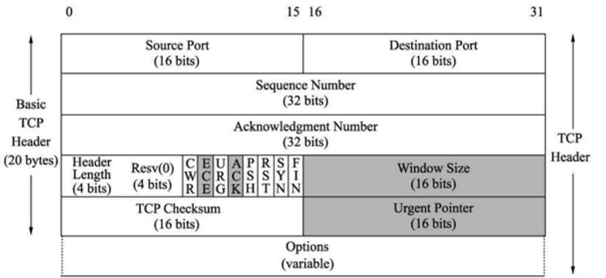
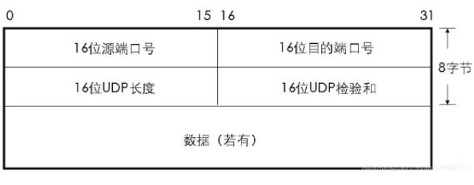
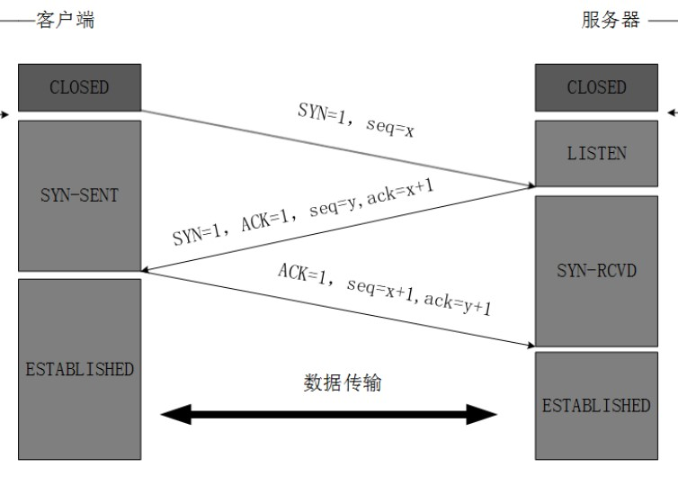
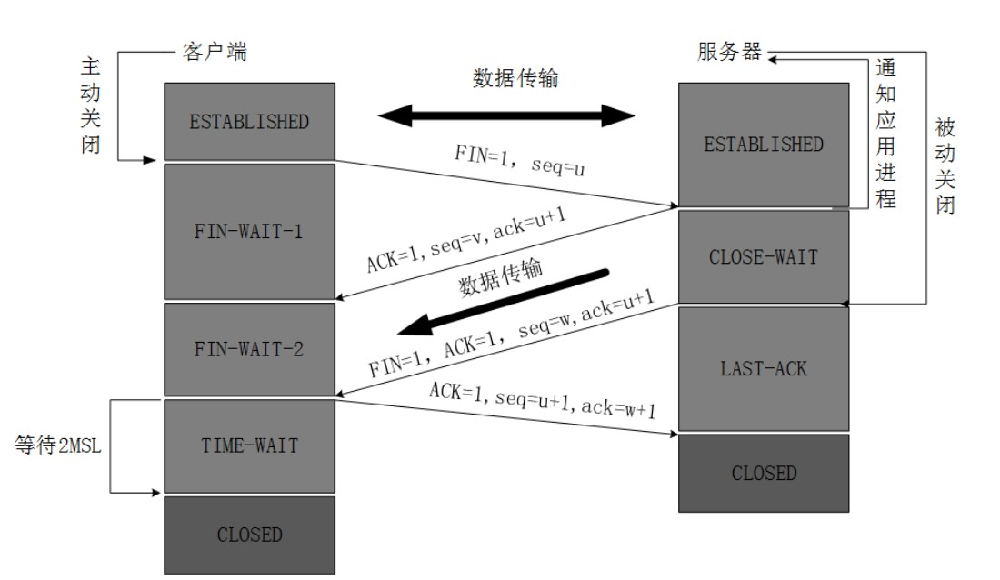

## TCP 协议特点
* 面向连接
* 点对点通信
* 提供可靠的传输服务
* 拥塞控制和流量控制机制
  * 拥塞控制

        不让一开始发送方发送大量的数据

  * 流量控制

        建立连接的双虎互相知道彼此剩余的缓冲区大小。

## TCP 报文格式：
        32 位： 16位源端口号， 16位目的端口号
        32 位： 32位序号
        32 位： 32位确认序号
        32 位： 4 位首部长， 保留6位， [URG], [ACK], [PSH], [SYN], [FIN]， 16位窗口大小
        32 位： 16位校验和， 16位紧急指针
        ？      选项
        ？      数据

        可以对比一下udp报文

## 三次握手

## 四次挥手

