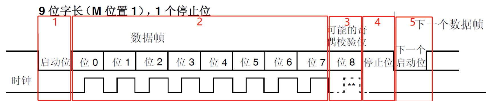

 <!-- Author : pickjly
 Email  : 2461789521@qq.com
 Date   : 2021-06-21
 Time   : 9:00
 File   : @pickjly_Linux_UART.md
 Content:
      UART 通信协议 -->
# UART 通用异步收发传输器

        UART是常用的通信协议之一，英文是Universal Asynchronous Receiver/Transmitter，工作原理是将传输数据的每个字符一位接一位地传输，它能将要传输的资料在串行通信与并行通信之间加以转换，能够灵活地与外部设备进行全双工数据交换。

## UART 通信协议

        - 起始位：当未有数据发送时，数据线处于逻辑“1”状态；先发出一个逻辑“0”信号，表示开始传输字符。
        - 数据位：紧接着起始位之后。资料位的个数可以是4、5、6、7、8等，构成一个字符。通常采用ASCII码。从最低位开始传送，靠时钟定位。
        - 奇偶校验位：使得“1”的位数应为偶数（偶校验）或奇数（奇校验），以此来校验资料传送的正确性。
        - 停止位：
        - 空闲位或者起始位